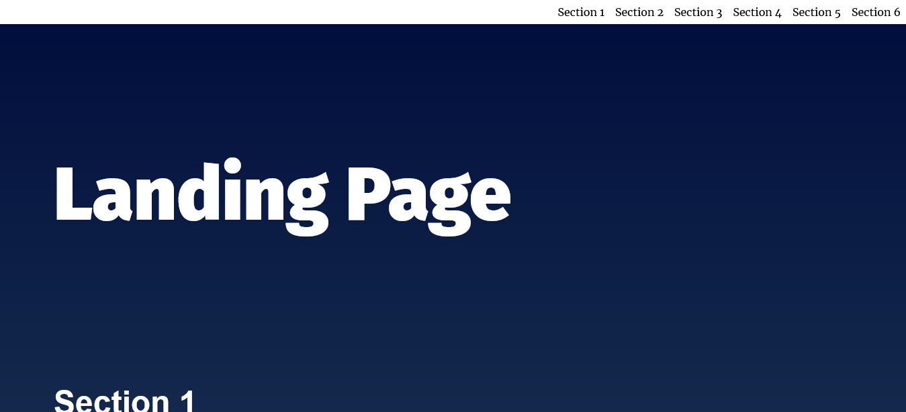
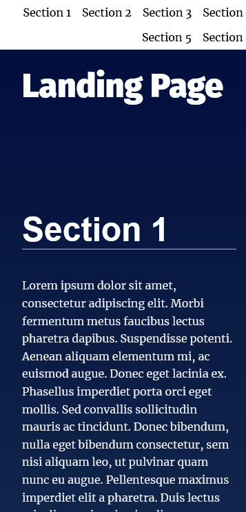

# Landing Page Project

The starter project has some HTML and CSS styling to display a static version of the Landing Page project. the challenge is to convert this project from a static project to an interactive one.This will require modifying the HTML and CSS files, but primarily the JavaScript file.

## Table of contents

- [Overview](#overview)
  - [The challenge](#the-challenge)
  - [Screenshot](#screenshot)
  - [Links](#links)
- [My process](#my-process)
  - [Built with](#built-with)
- [Author](#author)

## Overview

### The challenge

Users should be able to:

- Know which section is being viewed while scrolling through the page.
- When clicking an item from the navigation menu, the link should scroll to the appropriate section.
- Use scroll up button to go to the top of the page.

### Screenshot

### Links

- Live Site URL: [live site URL](https://mohamedlebda.github.io/frontend-mentor-product-preview-card/)

## My process

### Built with

- CSS custom properties
- Vanilla JS

## Author

- GitHub - [MohamedLebda](https://github.com/MohamedLebda)
